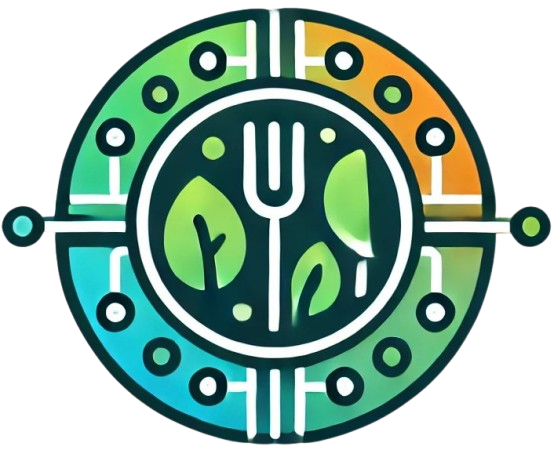

# 🥗 SmartMeal AI

<div align="center">
  
  <h3>An AI-powered smart meal planning assistant for health, fitness, and dietary optimization</h3>
</div>

---


---

## 📖 Table of Contents

* [About](#about)

  * [Screenshots](#screenshots)
  * [Features](#features)
  * [Tech Stack](#tech-stack)
* [Getting Started](#getting-started)
* [Usage](#usage)
* [Roadmap](#roadmap)
* [Contributing](#contributing)
* [License](#license)
* [Contact](#contact)
* [Acknowledgements](#acknowledgements)

---

## 🌟 About

SmartMeal AI is a personalized meal planning application powered by artificial intelligence. Built with FlutterFlow and Firebase, this app allows users to set health goals, receive meal recommendations, and track nutritional progress through an intuitive mobile UI.

This application is ideal for individuals seeking:

* Weight loss or muscle gain
* Meal prep planning
* Dietary accommodations (e.g. vegan, keto)
* AI-generated recipes based on preferences

## 🖼️ Screenshots

<div align="center">
  
  
  
</div>

---

## 🚀 Features

* 🔐 Firebase Authentication
* 🧠 AI Recipe Generation via Google Cloud / Vertex AI
* 🍽️ Nutrition Dashboard with Personalized Meal Plans
* 📋 Health Goal Tracking
* 🎯 Onboarding Surveys (age, goal, diet, favorites)
* 🔁 Weekly Prep Goals + Progress Tracking
* 🧩 Modular UI with FlutterFlow

---

## 🛠 Tech Stack

### Client

* FlutterFlow 
* Flutter (via FlutterFlow)
* Dart

### Backend / Services

* Firebase Auth, Firestore, Storage
* Firebase Cloud Functions
* Google Vertex AI (for text + recipe generation)
* Edenam API - Meal Creation 

---

## 🧰 Getting Started

### Prerequisites

* Flutter SDK
* Firebase CLI
* Dart >= 3.0

### Installation

```bash
git clone https://github.com/zrjohnson3/SmartMealAI.git
cd SmartMealAI
flutter pub get
firebase login
firebase use --add
```

### Running the App

```bash
flutter run
```

### Running Integration Tests

```bash
flutter test integration_test/test.dart
```

---

## 📦 Usage

1. Launch app
2. Click **Get Started**
3. Complete onboarding survey (age, goals, preferences)
4. SmartMeal AI generates your personalized plan
5. View dashboard, swap meals, edit prep goals

---

## 🧭 Roadmap

* [x] User Authentication
* [x] AI Meal Generator
* [x] Health Goal Surveys
* [ ] Smart grocery list generator
* [ ] Cross-platform sync
* [ ] Premium account upgrades

---

## 🤝 Contributing

We welcome contributions! Check out the [`CONTRIBUTING.md`](CONTRIBUTING.md) and create a feature branch off `main`.

### 🧾 Code of Conduct

Please follow our [Code of Conduct](doc/CONDUCT.md).

---

## ⚖️ License

This project is licensed under the MIT License. See the [LICENSE](LICENSE) file for details.

---

## 📬 Contact

Zachary Johnson
📧 [zrjohnson3@gmail.com](mailto:zrjohnson3@gmail.com)
🔗 [LinkedIn](https://www.linkedin.com/in/zrjohnson3)
🔗 Project: [SmartMealAI GitHub](https://github.com/zrjohnson3/SmartMealAI)

---

## 💎 Acknowledgements

* [FlutterFlow](https://flutterflow.io)
* [Firebase](https://firebase.google.com)
* [Vertex AI](https://cloud.google.com/vertex-ai)
* [Awesome README Template](https://github.com/Louis3797/awesome-readme-template)
* [Shields.io](https://shields.io/)
* [OpenAI](https://openai.com)

---
